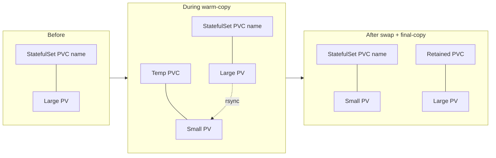
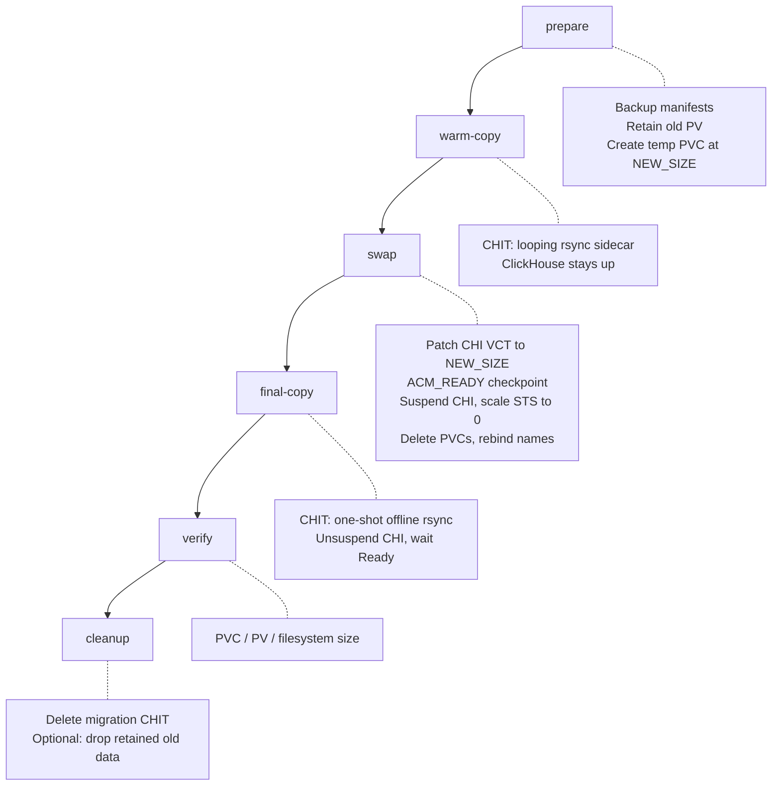

# ClickHouse Volume Downscale

Shrink a ClickHouse data volume when the storage class cannot shrink a PVC in place. The procedure replaces the large PVC with a smaller one, copies data with rsync, and keeps the old volume as a rollback source until you delete it.

It targets clusters managed by the ClickHouse Operator (`ClickHouseInstallation`). On Altinity Cloud Manager (ACM), user also needs to update the desired volume size in ACM so it does not re-expand the claim after the swap. Same applies if CHI is managed by any external system or GitOps.

Prefer a second disk and ClickHouse `MOVE PARTITION` / storage policies when that meets the goal. Use this PVC-swap path only when the final layout must be a **single smaller volume**.

Automation lives in [`volume_downscale.sh`](volume_downscale.sh).

## When to use it

| Situation | Approach |
| --- | --- |
| Need more capacity or rebalance tables | Add a disk / storage policy; move partitions in ClickHouse |
| Must keep one volume, smaller than today | This procedure |
| Provider supports PVC shrink | Prefer native shrink; do not use this runbook |

Hard requirements before you start:

- Used data fits in `NEW_SIZE` with headroom
- New and old PVs land in the same zone
- You can take a maintenance window for the offline final sync if single replica cluster is downscaled
- CHI (and ACM, if used) will accept `NEW_SIZE` as the desired size

## Core idea

Kubernetes cannot safely rename a PV under a StatefulSet claim. The script therefore:

1. Provisions a **new smaller PV** under a temporary PVC
2. **Warm-copies** while ClickHouse still runs (most of the data)
3. Stops the replica, **swaps claim names** so the StatefulSet’s original PVC name points at the new PV
4. **Final-copies** offline (consistency)
5. Keeps the old large PV bound under a retained PVC name until you clean up



## Workflow

Phases map 1:1 to `volume_downscale.sh`. Typical run:

```bash
NS=<namespace> TARGET_STS=<statefulset> NEW_SIZE=<size> ./tools/volume_downscale.sh all
```

Or run phases one at a time: `derive` → `prepare` → `warm-copy` → `swap` → `final-copy` → `verify` → `cleanup`. Recovery helper: `bind-old-pv`.



### prepare

Discover CHI, PVC, PV, sizes; write backups under `disk-shrink-backup/<pod>/`; set the old PV reclaim policy to `Retain`; create the temporary smaller PVC (same storage class / access modes; copies `spec.epc.altinity.com/*` annotations when present).

### warm-copy

Apply a `ClickHouseInstallationTemplate` that adds a restartable rsync **initContainer**. It mounts the live data volume read-only and the new PVC as the destination. ClickHouse keeps serving traffic; rsync may see vanished files—that is expected.

The script waits until rsync “Literal data” is small enough for a short offline window (`WARM_COPY_*` knobs), then asks for `WARM_COPY_READY`.

### swap (destructive)

1. Patch the CHI `VolumeClaimTemplate` to `NEW_SIZE`
2. **ACM_READY**: confirm ACM (if used), CHI, and the temp PVC all show `NEW_SIZE`—otherwise ACM/operator can re-expand later
3. Suspend CHI, drain ready markers, scale the StatefulSet to 0
4. Delete both PVC objects (PVs retained), clear `claimRef`, recreate:
   - Original PVC name → **new** small PV
   - Retained PVC name → **old** large PV (rollback source)

### final-copy

Replace the warm-copy CHIT with a one-shot offline rsync init container (old retained volume → new data mount). Unsuspend CHI. ClickHouse starts only after final sync succeeds and the pod becomes Ready.

### verify / cleanup

Check that PVC, PV capacity, and `df` all report `NEW_SIZE`. After validation, delete the migration CHIT and restore normal reclaim policy on the live PV. Delete the retained old-data PVC only when rollback is no longer needed (`DELETE_OLD_DATA` vs `SKIP`).

## Volume layout by phase

```mermaid
sequenceDiagram
  participant CH as ClickHouse pod
  participant Old as Large PV
  participant New as Small PV

  Note over CH,New: prepare — New PVC created, often Pending until scheduled
  CH->>Old: read/write live data
  Note over CH,New: warm-copy — both mounted; rsync loops
  Old-->>New: online rsync
  Note over CH,New: swap — pod stopped; claim names swapped
  Note over CH,New: final-copy — offline rsync then start CH
  Old-->>New: offline rsync
  CH->>New: live data on small volume
  Note over Old: retained until cleanup
```

## Inputs

| Variable | Meaning |
| --- | --- |
| `NS` | Namespace |
| `TARGET_STS` | StatefulSet (e.g. `chi-…-0-0`) |
| `NEW_SIZE` | Desired capacity (e.g. `1500Gi`) |

Everything else (CHI name, PVC/PV ids, migration CHIT name, workdir) is derived. Optional overrides and timeouts are documented in `./tools/volume_downscale.sh` usage.

```bash
TARGET_STS=chi-otel-logs-otel-logs-0-0 \
NEW_SIZE=1500Gi \
./tools/volume_downscale.sh all
```

`--auto-confirm` / `AUTO_CONFIRM=yes` skips most typed gates **except** `ACM_READY`. Retained-data deletion still requires `DELETE_OLD_DATA` or `SKIP`.

## Prefer second disk when possible

If ACM (or your platform) can attach another volume:

1. Add the disk and a storage policy that includes both disks
2. Move heavy tables/partitions in ClickHouse
3. Monitor `system.parts` / `system.moves`

Stop there if that solves capacity. Continue with PVC swap only if a single smaller volume is mandatory.

## Risks and operator rules

- **Desired size must stay `NEW_SIZE`** in CHI and ACM after the swap, or the claim can grow again
- **Do not delete** the retained old PVC until validation and retention are done—it is the rollback source
- CHITs need a `taskID` bump to force reconcile; pod templates merge by name
- Migration CHITs add `initContainers` only—leave regular containers to the operator
- Patch PV reclaim policies explicitly; do not assume they match CHI defaults

## Rollback (before deleting retained old data)

1. Suspend CHI, scale STS to 0
2. Swap claims so the StatefulSet PVC name points at the old large PV again
3. Restore CHI VCT (and ACM) to `OLD_SIZE`
4. Resume CHI and re-sync if needed

After the retained PVC/PV are deleted, rollback from this procedure is gone.

## Script reference

| Phase | Role |
| --- | --- |
| `derive` | Print derived names/sizes |
| `prepare` | Discovery, backup, retain, temp PVC |
| `warm-copy` | Online rsync via CHIT |
| `swap` | Size patch, ACM gate, suspend, PVC rebind |
| `final-copy` | Offline rsync, resume |
| `bind-old-pv` | Recovery if retained PVC naming conflicts |
| `verify` | Size checks |
| `cleanup` | Remove CHIT; optional old-data delete |
| `all` | Full pipeline |
